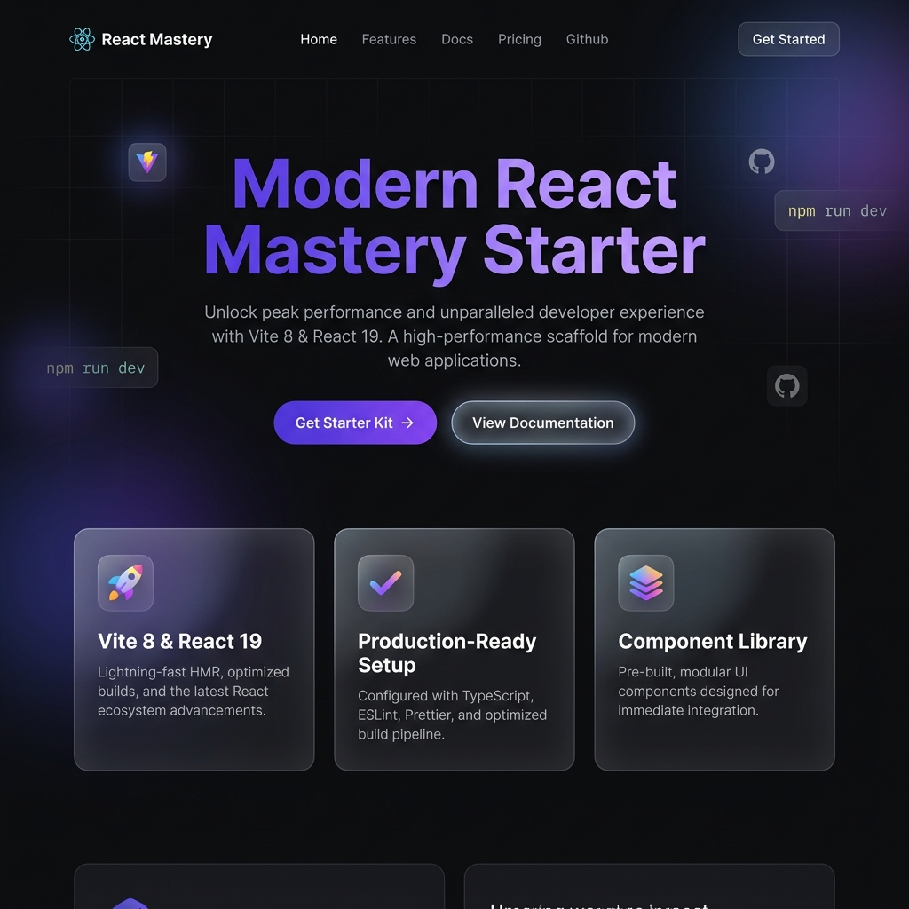

# Vite + React Modern Starter Template




A professional, high-performance starter template for modern React applications, built with **Vite 8** and **React 19**. This template is designed for developers who want a premium starting point with the latest technology stack and cleanest configuration.

## 🚀 Features

- **React 19**: Leverage the latest features of the React ecosystem.
- **Vite 8**: Ultra-fast development and build pipeline.
- **ESLint 9**: Modern flat configuration for better code quality.
- **Premium Design**: Built-in sleek dark mode, glassmorphism, and smooth animations.
- **SEO Optimized**: Standard meta tags and semantic HTML structure.

## 🛠 Tech Stack

- **Frontend**: React 19, JavaScript (ESM)
- **Build Tool**: Vite 8
- **Styling**: Vanilla CSS (Modern CSS variables)
- **Linting**: ESLint 9

## 📋 Getting Started

### Prerequisites

- Node.js (Latest LTS recommended)
- npm or yarn

### Installation

1. Clone the repository:
   ```bash
   git clone https://github.com/rajjitlai/vite-react-starter-template.git
   ```

2. Install dependencies:
   ```bash
   npm install
   ```

3. Start development server:
   ```bash
   npm run dev
   ```

4. Build for production:
   ```bash
   npm run build
   ```

## 📂 Project Structure

```text
├── assets/        # Project visual assets and screenshots
├── src/
│   ├── App.jsx        # Main component with landing page logic
│   ├── main.jsx       # Application entry point
│   └── global.css     # Premium design system tokens and styles
├── eslint.config.js   # ESLint 9 flat config
├── vite.config.js     # Vite configuration
└── package.json       # Project dependencies and scripts
```

## 📜 License

Created by **Rajjit Laishram** (2026).
Distributed under the MIT License. See `LICENSE` for more information.
